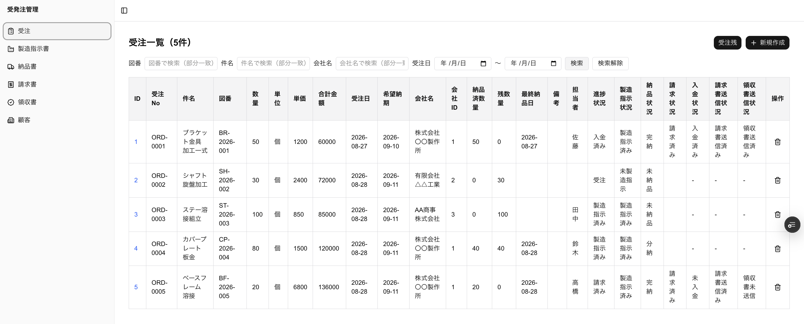
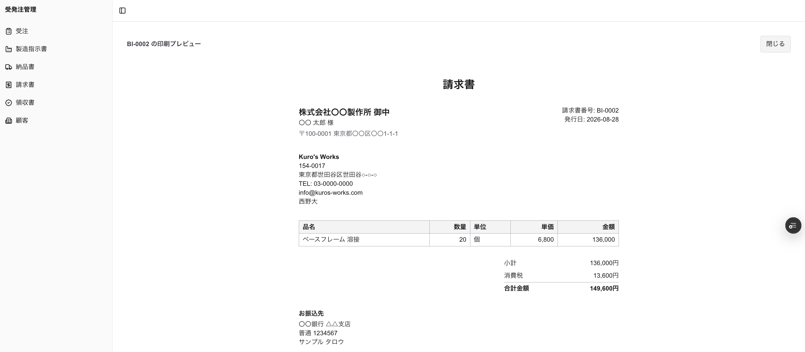
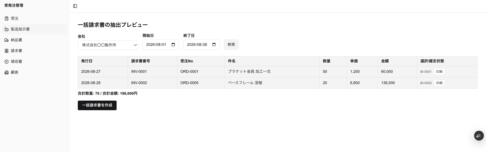

# Kuro's Order Management

受注IDを起点に、受注・製造指示書・納品書・請求書・領収書をリレーションで繋いだ、中小製造業向けの業務管理システム。

**進捗ステータスを人が入力する列は、ひとつも存在しない。**

受注・製造指示書・納品・請求書・領収書は、すべて受注IDと1対1。集計はこの1対1のレコードを期間や会社で絞り込むだけで、専用テーブルを持たない。

---

30年前、同じ設計をFileMakerで構築し、5年間運用した。1日50枚の注文書を処理しても1円のズレは出ず、**事務員と自分にそれぞれ1日3時間あった残業が、ゼロになった。**

ただし当時の比較対象は手書きの伝票である。現在、多くの現場はExcelを使っている。だからこの数字がそのまま再現されるとは考えていない。

しかしExcelに移行しても、**同じ数字を複数のファイルに打ち直す作業と、進捗が把握できない問題は残ったままである。** 受注表・納品書・請求書がそれぞれ別ファイルとして存在し、そのあいだを人が転記して繋いでいる限り、ズレる余地と探し直す時間はなくならない。

このシステムが解こうとしているのは、そこである。

本システムは、その設計をGit管理可能なモダンなWeb技術（Next.js / Supabase / Vercel）に翻訳したものである。コードを書かない設計者が、AIによる実装と分担して個人開発・2ヶ月で構築した。

---

## なぜ作ったか

夕方から英語教室を運営している。日中の空き時間をどう活かすか——その答えを探すのに、2年以上かかった。

Web制作を学び、AIライティングを学び、GASでLINE連携の予約決済サイトを組み、銀行・カードのCSVを会計ソフト用に変換するツールを作った。フリースクールの開校も目指した。どれも動くところまでは作ったし、本気で取り組んだ。そして、どれも続かなかった。

失敗の連続だったが、そこから残ったものが一つある。**判断軸だ。**

- **Gitでバージョン管理できるか** — 壊れたときに戻せるか、変更の履歴を追えるか
- **拡張しても破綻しない構造か** — 機能を足したときに、既存が壊れないか

スクリプトを継ぎ足して作った仕組みは、規模が大きくなると崩れる。そして崩れたとき、どこが原因かを追える構造になっていない。2年かけて何度もそこに突き当たった末に出てきた基準だった。

この軸で自分の経験を振り返ったとき、答えは30年前にあった。

当時FileMakerで、受注・製造指示書・納品書・請求書・領収書をリレーショナルデータベースで繋いだ業務システムを構築し、5年間運用した。**1日50枚の注文書を処理しても、1円のズレも出なかった。** 数字を人が転記する箇所を、そもそも作らなかったからだ。

ただしFileMakerはGit管理ができない。この制約が引っかかっていたとき、Claude Codeに相談して返ってきたのが「RDB設計ができるなら、Supabase / Vercel / GitHub で組めばいい」という提案だった。それがこのプロジェクトの出発点になっている。

**このシステムは、30年前に手で組んだRDB設計を、Git管理可能なモダンなWeb技術に翻訳したものである。** 設計思想は当時から変わっていない——数字を書き写さない。既にある数字を映し出す。

---

## 設計者について

コードは書けない。実装はClaude Codeに任せている。

ただし、**テーブル間のリレーションを設計する能力**については、FileMakerでの実務で身につけている。

表計算ソフトやGASで組む仕組みは、行と列という一枚の平面の中で完結する。データが増えれば列を足し、関連する情報は同じ行に書き写す。これが破綻の入口になる。

RDBは違う。データは複数のテーブルに分かれて存在し、テーブル同士は関連（リレーション）で結ばれる。ある情報を知りたければ、書き写すのではなく**関連を辿って取りに行く**。受注テーブルに会社名を書き写すのではなく、会社IDで顧客テーブルを参照する。

この構造を頭の中で組み立てられるかどうかが、業務システム設計の核心だと考えている。30年前にFileMakerでこの構造を組み、5年間運用して1円のズレも出さなかった経験が、そのままこのプロジェクトの設計に生きている。

**変わったのは実装手段だけで、設計する能力そのものは変わっていない。** AIは、その設計をコードに翻訳する役割を担っている。

---

## 技術選定

FileMakerで30年前に組んだ構造を、そのままWebに持ってくる。これが要件だった。ただしFileMakerにはGit管理ができないという制約がある。バージョン管理できない資産は、拡張していくときに必ず行き詰まる。

そこで、**「リレーションを正しく設計でき、かつGitで管理できる」** という条件で技術を選んだ。

| | Git管理 | データの持ち方 | 拡張時のコスト |
|---|---|---|---|
| FileMaker | 不可 | リレーション（参照） | 中 |
| ノーコード業務ツール（kintone等） | 限定的 | ルックアップ（転記が基本） | 高 |
| **Supabase + Vercel** | **可** | **リレーション（参照）** | **低** |

ルックアップとリレーションは、名前は似ているが根本的に違う。**ルックアップは値を自分のレコードにコピーして保持する。リレーションは値を持たず、必要なときに関連先を参照する。** 前者は参照元が変わったときにズレが生まれる余地があり、後者にはそれがない。この違いが、システム全体の設計思想を分ける。

なお、SAPをはじめとする大規模ERPは、この比較の対象に含めていない。**土俵が違うからだ。** 数百人規模の組織で、部門横断の統制と監査を前提に構築されるものであり、導入には相応の期間と費用がかかる。従業員数十名の製造業が、受注から領収書までを一本の線で繋ぎたいというだけの目的で選ぶものではない。

このシステムが埋めようとしているのは、**「ノーコードでは構造が持たない、ERPでは重すぎる」という中間の空白**である。

PostgreSQLをそのまま使えるSupabaseと、GitHubへのpushで自動デプロイされるVercel。この組み合わせが、リレーションを妥協せずに設計でき、かつGit管理下で拡張し続けられる構成として、最も開発コストが低いという判断に至った。

**結果として、このシステムは個人開発・2ヶ月で構築した。** コードを書かず、設計判断とAIによる実装を分担することで実現している。

---

唯一の1対多は納品明細だ。分納があるため、1つの受注に対して複数回の納品が発生しうる。

しかし、**納品明細を集計して「完納したか」を見た瞬間、それは受注に対して1対1になる。** 納品数量の合計が受注数量に達していれば完納、達していなければ分納、レコードがなければ未納品。1つの受注に対して、この状態はひとつしか存在しない。

だから請求書は受注と1対1で繋げる。完納した受注に対して、請求書が1件。領収書も1件。

**分納という業務上の例外を、集計というひとつの操作で吸収している。** 例外のために特別なテーブルやフラグを追加していない。

なお、この「完納」も列として保存していない。納品明細を合計して受注数量と比較しているだけである（転記ゼロ設計）。納品を1件追加すれば、完納判定は自動的に更新される。

### 逆リレーションによる進捗管理 — 「どこまでやったっけ」をなくす

このシステムの受注テーブルには、進捗ステータスという列が存在しない。

代わりに、**関連する子レコードの有無から進捗を導出している。** 製造指示書が作られていれば製造中、納品明細があれば納品済み、請求書があれば請求済み——実際に発生した記録そのものが、進捗を示す。

なぜこうしたのか。

1日50枚の伝票を処理していると、作業は必ず中断される。現場から呼ばれる。荷物が届く。電話が鳴る。お客さんが来る。用が済んで席に戻ったとき、事務員は必ずこう考える。

**「あれ、どこまでやってたっけ」**

そして、探し直す。この探し直す時間が、業務の中で最も無駄な時間だ。しかもこれは、事務員の注意力や能力の問題ではない。**進捗がわからないシステムを使わせている、会社側の問題である。**

進捗ステータスを列として持たせる設計だと、この問題は解決しない。人が更新する列は、更新し忘れる。中断が多い環境ではなおさらだ。そして一度ズレた進捗は、実態と食い違ったまま放置され、やがて誰も信用しなくなる。

**記録そのものから進捗を導出すれば、更新し忘れは構造的に起こりえない。** 製造指示書を発行した事実が、そのまま「製造指示済み」を意味する。二重の作業がない。席に戻った事務員は、一覧を開けば全件の現在地が見える。

これが、受注IDを起点にすべての帳票をリレーションで繋いだ最大の理由である。

### 自動化しない — 人間の行動が、状態を変える

このシステムは、帳票を自動でメール送信しない。PDFも自動生成しない。ブラウザの印刷機能（⌘+P）で出力し、事務員がメールに添付して送る。

意図的にそうしている。

**理由1：PDFを作ったことと、送ったことは別の事実である**

請求書のPDFを生成した時点で「送信済み」にしてしまうシステムは多い。だが実務では、PDFを作った後に送らないことがある。金額の確認待ち。先方の担当者が不在。今月はまとめて来月に回す——理由はいくらでもある。

**「作ったが、まだ送っていない」という状態が実務には確かに存在する。** それをシステムが表現できなければ、進捗は実態とズレる。

だからこのシステムでは、送信フラグは人間がチェックする。送ったという事実を、送った人間が記録する。自動転記しない。

**理由2：自動化は、開発コストと運用コストの両方を増やす**

メール送信を自動化すれば、送信ライブラリの導入、テンプレート管理、送信失敗時のリトライ処理、ログの保持——付随する仕組みが一式必要になる。作るコストがかかり、その後も保守し続けるコストがかかる。

一方、事務員が⌘+Pで印刷してメールに添付する作業は、数十秒で終わる。**既に事務員が毎日やっている操作であり、新しく覚えることがない。**

数十秒の作業を消すために、開発費と保守費を払い続ける判断が、中小企業にとって合理的とは考えなかった。

**理由3：そもそも、これは自動化システムではない**

このシステムが解決しようとしているのは「作業を自動化すること」ではない。**「今どこまで進んでいるかが常に正確にわかること」**である。

自動化されていない部分——送信済みのチェック、入金確認——は、人間が押した1クリックがそのまま記録になる。そして押されていなければ、押されていないという事実が正確に見える。**曖昧な状態が残らない。**

自動化されたシステムは、自動処理が走ったのか走っていないのかを人間が確認しに行く必要がある。手動なら、確認するまでもなく画面に出ている。

**これはRDBである。リレーションで業務を繋ぐシステムであって、業務を代行するシステムではない。**

---

## 何ができるか

受注から領収書まで、5つの帳票が受注IDで一本に繋がっている。

**どの判定にも、人が入力したステータス値は使われていない。** 実際に発生した記録の有無と、その記録が持つ値だけで決まる。

この構造は、コードレベルでも守られている。個別請求書の作成処理は、残数量がゼロでなければ「分納途中の受注は請求できません」と弾き、既に請求書が存在すれば「すでに請求済み」と弾く。**1受注1請求書という原則が、実装で担保されている。**

### 残っている幽霊列について

`orders` テーブルには `status` というカラムが実在する。しかしコード上のどこからも読み書きしていない。開発初期に作り、進捗を子レコードから導出する設計に切り替えた時点で不要になった列である。

**残っているが、使っていない。** 削除自体は容易だが、稼働中のシステムでカラムを消す作業には常にリスクが伴うため、動作に影響しない以上あえて触っていない。設計変更の履歴として、そのまま残している。

---

## 一括請求の実装 — 確定前は抽出、確定後はスナップショット

一括請求書には、二つの相反する要求がある。

**送る前は、常に最新でなければならない。** 請求書を追加したり修正したりすれば、それが反映されてほしい。

**送った後は、絶対に変わってはならない。** 客先に出した請求書の内容が、後から勝手に書き換わるシステムは会計上使えない。

このシステムは、テーブルを増やさずにこの両方を満たしている。

### 確定前 — 毎回、その場で抽出する

会社と期間を指定すると、請求書テーブルをその条件で絞り込んで一覧表示する。合計金額もその場で計算する。**この時点では、何も保存していない。**

画面を開き直せば、そのときの最新データで再計算される。請求書を1件追加すれば、次に開いたときには含まれている。

### 確定 — 番号を振り、そこで固定する

「確定」を押した瞬間に、選択された請求書へ一括請求番号（`BI-0001`）と確定日時が書き込まれる。

このとき、実装上の重要な制約がある。

一括請求書が固定するのは「どの請求書がこの束に含まれるか」だけである。金額も件名も数量も固定しない。印刷のたびに、元の受注データから引き当てて明細を組み立てる。束ねる範囲は確定し、中身は常に元データを映す。

実装上は、確定操作は `batch_invoice_no` が `NULL` の行だけを対象にUPDATEする。これにより、同じ請求書が二重に一括請求へ含まれる事故が構造的に起こりえない。

---

## 技術スタック

| 領域 | 採用技術 |
|---|---|
| フロントエンド | Next.js（App Router）/ TypeScript |
| UI | Tailwind CSS / shadcn/ui / Kiranism dashboard template |
| データベース | Supabase（PostgreSQL） |
| ホスティング | Vercel（GitHubへのpushで自動デプロイ） |
| 帳票出力 | ブラウザ印刷（`@media print`） |
| 実装 | Claude Code |

### PDFライブラリを使っていない

帳票（製造指示書・納品書・請求書・領収書）はすべてHTMLで組み、`@media print` で印刷用のレイアウトを当てている。事務員が ⌘+P で印刷、またはPDFとして保存する。

PDF生成ライブラリを導入しなかった理由は二つある。

**依存を増やしたくなかった。** 帳票のレイアウトを変えるたびにライブラリの制約と戦うことになる。HTMLとCSSなら、画面を作るのと同じ技術で完結する。

**事務員の操作が変わらない。** ⌘+P は既に日常的に使っている操作である。新しいボタンや手順を覚える必要がない。

製造指示書はA6サイズで印刷される。A4複合機しか置いていない事務所が大多数という現実に合わせている。

### UIライブラリの使い方

画面の骨格には Kiranism のダッシュボードテンプレートを参照した。サイドバー、ヘッダー、一覧と単票の画面構成といったレイアウトの型を借りている。

ただし**そのまま使ってはいない。** テンプレートに含まれる認証・権限管理（Clerk依存）は取り除き、データ取得はすべて自前のSupabaseクエリに差し替えている。**借りたのは見た目の骨格だけで、中身は入れ替えた。**

コンポーネントはshadcn/uiの標準（Card / Input / Select / Badge / Table / AlertDialog）のみを使っている。凝ったデザインは事務書類には不要という判断である。

**このシステムの本体はRDB設計であり、UIはその構造を正確に映すための器**という位置づけを崩していない。

なお、既に稼働していた検索・ソート機能は、shadcn/uiへの置き換えを行っていない。見た目だけの変更にロジックの回帰リスクを負う理由がないためである。shadcn/uiは新規に作る画面から導入した。

### 実装の分担

設計判断（テーブル構成、リレーション、状態の定義、何を保存し何を保存しないか）はすべて人間が行い、コードの実装はClaude Codeが担当した。

DDL（テーブル定義の変更）と破壊的な操作は、AIに実行させず、Supabaseのコンソールから手作業で実行している。**構造を変える操作だけは、必ず人間の手を通す**という運用にしている。

---

## 制約と適用範囲

### 意図的に作らなかったもの

**完了ロック** — 入金済みの受注も編集できる。ロックをかけると、訂正が必要な場面ごとに解除の仕組みが要る。状態が一覧で常に見えていれば、誤操作は視認で防げるという判断である。

**請求額と入金額の自動照合** — 振込手数料の差引などで金額がずれることは実務では日常的に起きる。システムに判定させず、目視で確認する。差額を処理する必要があれば、マイナス金額の受注を1件起こして通常のフローに乗せる。**例外のための特別な仕組みを作っていない。**

**送付ログのテーブル** — 送った事実はフラグと日付のみを持つ。実際に送ったPDFはメールの送信済みフォルダとGoogleドライブに残るため、システム側に重複した記録を持たせていない。

### 締め日と支払サイト

支払サイト（`payment_terms_days`）は顧客マスタに持たせている。会社ごとに異なる支払条件を、事務員がこれを見ながら入金予定を管理する。

一方、締め日はカラムとして持っていない。代わりに、一括請求の抽出は**期間の開始日と終了日を自由に指定できる**設計にしている。20日締めの取引先なら「前月21日〜当月20日」を指定すればよい。**締め日を構造として固定しなかったことで、どんな締め日にも対応できる。**

### 適用範囲

**単一事業者を前提としている。** 複数の会社が1つのシステムを共有する構成（マルチテナント）は想定していない。

**認証はID・パスワードによるログインのみで、役割ごとの権限分けは実装していない。** 事務員と経営者で見える範囲を分ける必要が出た場合は、Supabase の Row Level Security で対応する余地を残している。

**同時編集の検証は行っていない。** 単一の担当者が操作する前提で構築しており、複数人が同じレコードを同時に編集した場合の挙動は未検証である。

---

## 今後の予定

**月次売上台帳のCSVエクスポート** — 税理士とのやり取りを想定している。表示中のデータを書き出すだけの実装で、既存の抽出ロジックをそのまま使える。

## この設計の応用

以下は本リポジトリの範囲外だが、ここで確立した構造をそのまま展開できると考えている。

**発注・支払側への展開** — 在庫 → 受注 → 最低在庫 → 発注書 → 請求書 → 支払CSV という仕入側の業務フロー。「起点となるIDに帳票を1対1で繋ぎ、進捗は子レコードから導出する」という構造は、向きを変えればそのまま使える。

**受注管理以外の業種への転用** — 本システムは製造業の用語で作られているが、構造そのものは業種に依存しない。

設備工事・電気工事のような業種でも、**「案件を受ける → 現場に指示を出す → 完了する → 請求する → 入金する」という流れは同じ**である。製造指示書を作業指示書に、納品書を完了報告書に読み替えれば、そのまま成立する。

受注IDを起点に帳票を1対1で繋ぎ、進捗を子レコードから導出するという構造は、**用語を入れ替えるだけで他業種に展開できる。**

---

## 注意事項

本リポジトリのデータはすべてサンプルである。顧客情報・発行者情報（住所・電話番号・銀行口座）は架空の値に置き換えてある。

---

## リンク

- **デモ環境** — https://kuros-order-management.vercel.app
- **設計解説記事** — （準備中）

## 開発者

**Kuro's Works ／ 西野 大**

東京都世田谷区を拠点に、中小企業向けの業務システム設計・開発を行っています。30年前にFileMakerで構築した受注管理システムを5年間運用した経験をもとに、現代のWeb技術で同じ構造を再構築しました。

受注管理に限らず、**受注 → 作業 → 完了 → 請求 → 入金**という流れを持つ業務であれば、業種を問わず設計から対応できます。

お問い合わせ：info@kuros-works.com
